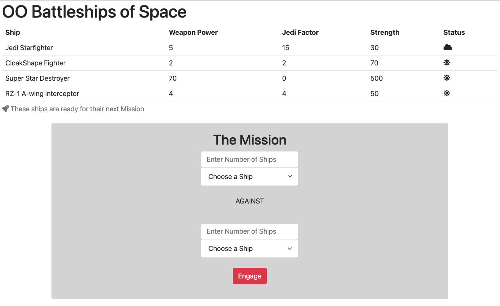
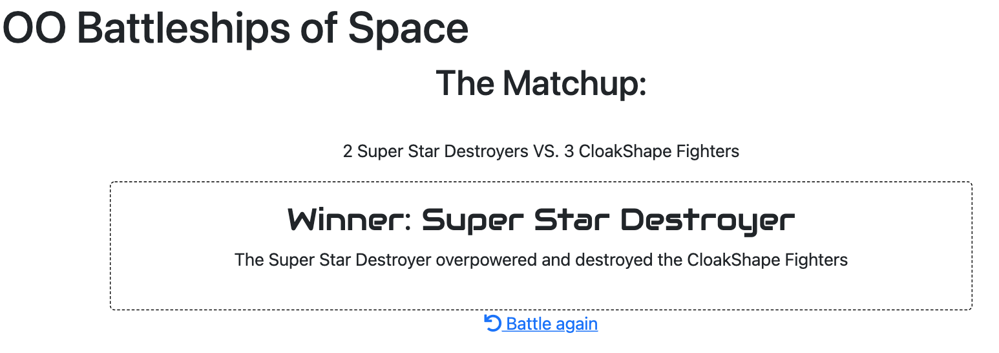

# Battleship Game with PHP and PDO Database

## Overview of Project
The goal of this project is to create battleship game using PHP with PDO database connection as well as PHP Service Container. The results of which ship wins will display in the browser. The table contains the ships data. The sun icon under status means the ship is ready to battle where the cloud icon means the ship is broken.

#### Battle

#### Result

## Resources and Tools
1. Sequel Pro
2. MySQL Database 
3. Composer
4. Web browser: Google or FireFox

## File Structure
* Model folder contains classes that hold all the data
* Service folder contains classes that do all the work

### NOTES
* New class called RebelShip was created inside Model folder for inheritance method.
* New class called AbstractShip was created inside Model folder for Abstraction method.
* New class called BrokenShip was created inside Model folder to show that the ship is always broken.